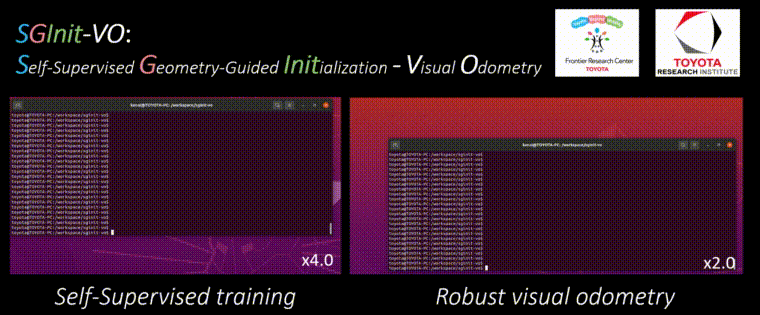

<!-- Copyright 2024 Toyota Motor Corporation.  All rights reserved.  -->
# SGInit-VO

<a href="https://global.toyota/en/mobility/frontier-research/" target="_blank">
 
</a>


[Installation](#installation) | [Usage](#usage) | [License](#license) | [Thanks](#Thanks)

**SGInit-VO** is a repository containing scripts to replicate the experiment in the paper, titled <i> "Self-Supervised Geometry-Guided Initialization for Robust Monocular Visual
Odometry." </i> by Takayuki Kanai, Igor Vasiljevic, Vitor Guizilini, and Kazuhiro Shintani.

**UPDATE**: Accepted at [IROS2025](https://www.iros25.org/)🚀

The paper and the project page are available:

- **arXiv**: https://arxiv.org/abs/2406.00929v1
- **Project Page**: https://toyotafrc.github.io/SGInit-Proj/


The codebase is originally from [DROID-SLAM](https://github.com/princeton-vl/DROID-SLAM) by Teed *et al.,* and is distributed under the **Creative Commons Attribution-NonCommercial (CC-BY-NC)** License, following the license of [TRI-ML/VIDAR](https://github.com/TRI-ML/vidar), which is adapted to this repository.

Note that, we cannot guarantee future monitoring and official support while we strive to provide assistance or
maintenance.

<p align="center">
  
</p>

<p align="center">
Official implementation of the visual odometry, as well as from-the-scratch pre-training demo.</p>

## Installation

Add submodule libraries.

```bash
git submodule update --init --recursive
make noroot-build
```

## Usage

### Data Preparation
Appropriately modify the `CKPT_MNT`, `DATA_MNT`, etc. at [Makefile](Makefile) and run:

```bash
xhost +local:root # if needed for GUI
make noroot-interactive
```
We enter the container, and the following procedures are conducted inside the container hereafter.

#### Download dataset, models, etc. (for your first time)
Please download the dependent items to your PC as follows: 

```bash
./tools/download_ddad.sh # for DDAD (40GB) datasets
python ./tools/download_models.py # for pretrained models
```

#### Replicate Visual Odometry (SG-Init + DROID (L), GIF's Right)

```bash
./shells/run.sh
```

#### Replicate Ablation Model (ZeroDepth + DROID)

```bash
./shells/run_ablation.sh
```


#### Replicate Depth Evaluation  (ResNet18 from ``L'' model)
```bash
python3 thirdparty/vidar/scripts/launch.py configs/papers/sginit/inference_resnet18s.yaml
```

#### Running on your own data
Please refer to [TUTORIAL.md](materials/TUTORIAL.md) for more details.


## License

This repository is released under the the Creative Commons Attribution-NonCommercial [(CC-BY-NC)](LICENSE) License.

## Thanks
We thank the authors of DROID-SLAM for the publicly available code release.

All files without headers are left unchanged and originate from the original codebase. 

Otherwise, we left the header on the source files with its copyright.
